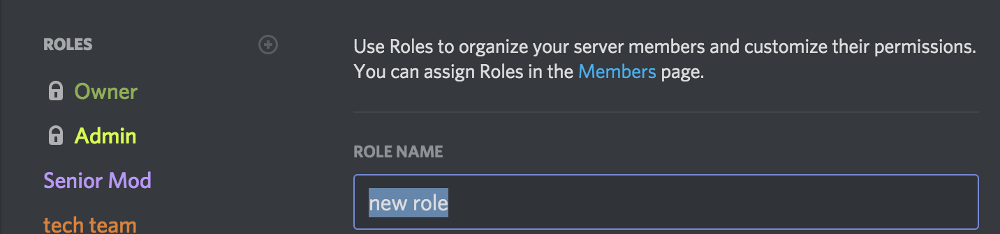

# Technical 

## Add New Raid Boss
This section will walk you through adding a new raid boss to the channels log. 

### Add Roles

1. Click the down-arrow on the top left and click on "Server Settings".


2. Click on "Roles".


3. Click on the "+" right beside the "Roles" heading.


4. A new window will pop up. Here, you can edit the role title by highlighting "new role".



### Add Channels

1. Click on the "+" icon next to the category name.


2. This will prompt you to create a new text channel. There are three options: text, voice, and announcement. For the most part, we will be creating text channels. You can also toggle it as a private channel so you can set up whatever you want to set up before it goes live (recommended).
For now, just set the name under "Channel Name".


3. Once you've decided on a name, go ahead and toggle the button next to "Private Channel" (the button will turn green once toggled on). Click "Next".


4. Set up some permissions of which roles you want seeing this.


### Limit to Specific Boss

1. Before you set your raid restriction(s), you need to set up the channel as a remote raid lobby. To do this, go to the #pokenav channel and toggle it as a *remote raid lobby*.

**NOTE: Make sure PokeNav can read and type in the channel**


To break this down, the code is **.toggle remote-raid-lobby #channel**

2. Now, you create your raid boss restriction. You can also further limit it according to tier:


The code for this is **.create raid-boss-restriction #channel <tier>**

Or just by boss:


The code for this is **.create raid-boss-restriction #channel <boss>**

### Create a Notify-Rule 

1. Go to #pokenav and link the boss role to the bot notification system (this is used whenever a raid is created via PokeNav).


2. Create the notification rule.


The code for this is **.create notify-rule @role "boss: pokemon"**

### Uploading Emojis 

1. Go to Google and type (insert boss name here) transparent png and select "Images".


2. Download the first PNG you see and hope for the best.
*Make sure it has a background like the one below for the best results*


3. Make sure the image is really transparent (some PNGs that appear transparent have that ugly background, so there are a few ways to fix them)
- Find a new PNG if you're lazy
- Go to [LunaPic](https://www12.lunapic.com/editor/?action=transparent)
- Remove the background on Photoshop

4. Make sure the image is under 256 kb. If it's too big, use [TinyPng](https://tinypng.com/).

5. If you made it this far, congrats! You've done the painful part :D
---

## Pokénav Down Protocol
You will do the following for each of the raid rooms that are currently active.

### Step 1: Lock Down Pokénav Channels

1. **Click "Edit Channel"**


2. **Click "Permissions"**


3. **Click "Verified" Role**


4. **Turn OFF the following settings**
	- Send Messages
	- Attach Files


5. **Click "Save Changes"**

!> Be sure to click "Save Changes". 

---

### Step 2: Post "Down" Message

This message should be posted and pinned in **all Pokénav channels.**

```
**__POKENAV BOT IS TEMPORARILY DOWN__**
We apologize for any inconvenience, we will open this channel after the bot is brought back online. 

Please use Raid Rooms 1 - 7 for your raids until the issue is resolved. (Links below)

#raid-room-1 
#raid-room-2 
#raid-room-3 
#raid-room-4 
#raid-room-5 
#raid-room-6 
#raid-room-7
```
---

### Step 3: Open Raid Rooms

1. Click "Edit Category"

2. Click "Permissions"

3. Click "+" to add new Role Permission

4. Search for the "Verified" role and select it.

5. Turn ON the following settings:
	- View Channels
	- Send Messages
	- Attach Files
	- Add Reactions
	- Read Message History

6. Click "Save Changes"

!> Be sure to click "Save Changes".

---

### Step 4: Notify #headlines_and_news

```
@everyone

**__POKENAV BOT IS TEMPORARILY DOWN__**
We apologize for any inconvenience, we will open these channels after the bot is brought back online. 

Please use Raid Rooms 1 - 7 for your raids until the issue is resolved. (Links below)

#raid-room-1 
#raid-room-2 
#raid-room-3 
#raid-room-4 
#raid-room-5 
#raid-room-6 
#raid-room-7
```