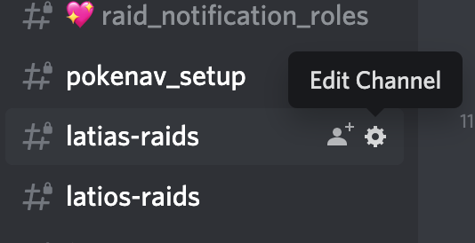
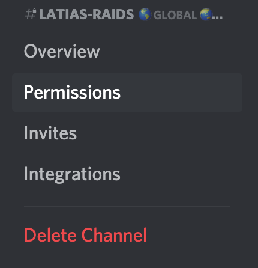
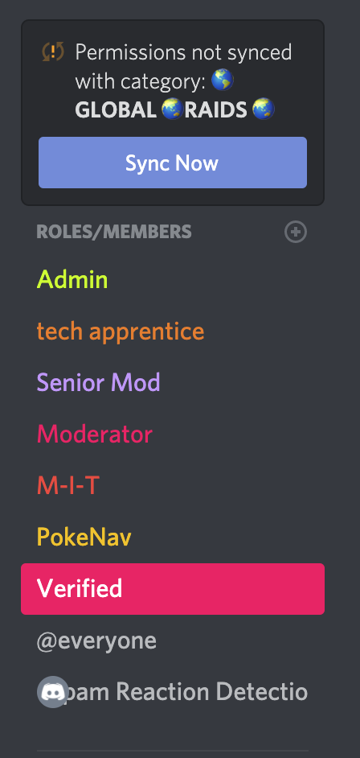
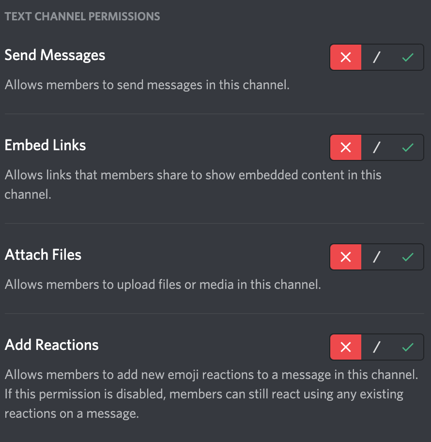

# Technical 

## New Raid Boss

### Add Roles

### Add Channels

### Limit to Specific Boss

## Pokénav Down Protocol
You will do the following for each of the raid rooms that are currently active.

### Step 1: Lock Down Pokénav Channels

1. **Click "Edit Channel"**


2. **Click "Permissions"**


3. **Click "Verified" Role**


4. **Turn OFF the following settings**
	- Send Messages
	- Attach Files


5. **Click "Save Changes"**

### Step 2: Post "Down" Message

This message should be posted and pinned in **all Pokénav channels.**

```
**__POKENAV BOT IS TEMPORARILY DOWN__**
We apologize for any inconvenience, we will open this channel after the bot is brought back online. 

Please use Raid Rooms 1 - 7 for your raids until the issue is resolved. (Links below)

#raid-room-1 
#raid-room-2 
#raid-room-3 
#raid-room-4 
#raid-room-5 
#raid-room-6 
#raid-room-7
```

